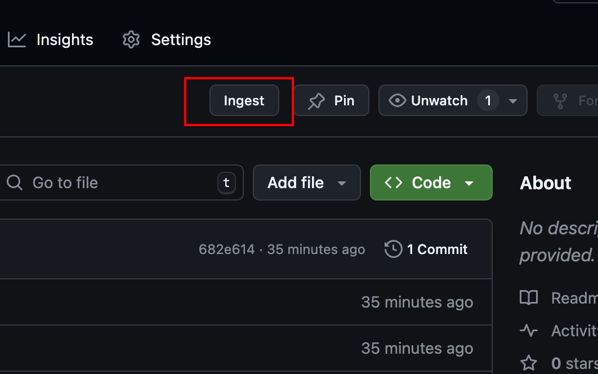

# GitIngest Chrome Extension

[](https://chrome.google.com/webstore)
[](https://www.javascript.com/)
[](./GitIngest-v1.0.0/LICENSE)

A Chrome browser extension that enhances GitHub repository pages by providing a direct link to view repositories on GitIngest.com. With a single click, transform any GitHub repository URL into its GitIngest equivalent.

<p align="center">
  
</p>

## Features

- Adds an "Ingest" button next to GitHub's native buttons
- Automatically transforms GitHub URLs to GitIngest URLs
- Seamlessly integrates with GitHub's UI/UX patterns
- Preserves all path parameters and query strings
- Zero configuration required
- Minimal permissions required for security

## Installation

### Chrome Web Store (Recommended)
1. Visit the [GitIngest Extension](https://chrome.google.com/webstore) page
2. Click "Add to Chrome"
3. Confirm the installation

### Manual Installation (Development)

1. Clone this repository:
   ```bash
   git clone https://github.com/bartwisch/gitingestchromeplugin.git
   cd gitingestchromeplugin
   ```

2. Generate extension icons:
   - Open `GitIngest-v1.0.0/icon-generator.html` in your browser
   - Right-click each icon and save them as:
     - `icon16.png`
     - `icon48.png`
     - `icon128.png`
   - Save icons in the `GitIngest-v1.0.0` directory

3. Load the extension in Chrome:
   - Navigate to `chrome://extensions/`
   - Enable "Developer mode" (top right)
   - Click "Load unpacked"
   - Select the `GitIngest-v1.0.0` directory

## Usage

1. Visit any GitHub repository
2. Look for the "Ingest" button next to the "Code" button
3. Click to view the repository on GitIngest.com

## Development

### Project Structure
```
.
├── README.md                    # Project documentation
├── assets/                      # Project assets
│   ├── screenshots/            # Extension screenshots
│   ├── markups/               # Documentation markups
│   └── chromestore release/   # Chrome Web Store assets
└── GitIngest-v1.0.0/          # Extension source code
    ├── manifest.json          # Extension configuration
    ├── content.js            # Main extension logic
    ├── styles.css            # Button styling
    ├── icon-generator.html   # Tool to generate icons
    ├── icon16.png           # Extension icons
    ├── icon48.png           # Extension icons
    ├── icon128.png          # Extension icons
    └── LICENSE              # MIT License
```

### Local Development
1. Make changes to the source files
2. Reload the extension in `chrome://extensions/`
3. Refresh GitHub pages to see changes

### Building for Production
1. Update version in `manifest.json`
2. Create a new versioned directory (e.g., `GitIngest-v1.0.1`)
3. Copy the extension files to the new directory
4. Test thoroughly before publishing

## Contributing

Contributions are welcome! Here's how you can help:

1. Fork the repository
2. Create a feature branch (`git checkout -b feature/AmazingFeature`)
3. Commit your changes (`git commit -m 'Add some AmazingFeature'`)
4. Push to the branch (`git push origin feature/AmazingFeature`)
5. Open a Pull Request

## License

This project is licensed under the MIT License - see the [LICENSE](GitIngest-v1.0.0/LICENSE) file for details.

## Links

- [GitIngest Website](https://gitingest.com)
- [Report Issues](https://github.com/bartwisch/gitingestchromeplugin/issues)
- [Chrome Web Store](https://chrome.google.com/webstore)

## Acknowledgments

- Thanks to GitHub for their excellent UI components
- Icons generated using the included icon generator tool
- All contributors who have helped improve this extension